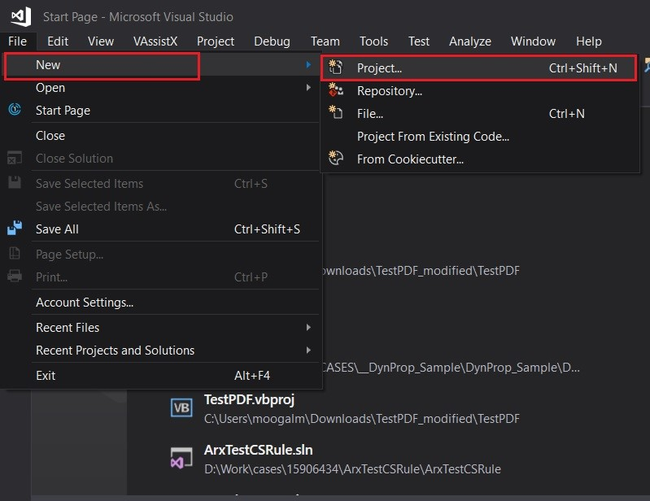
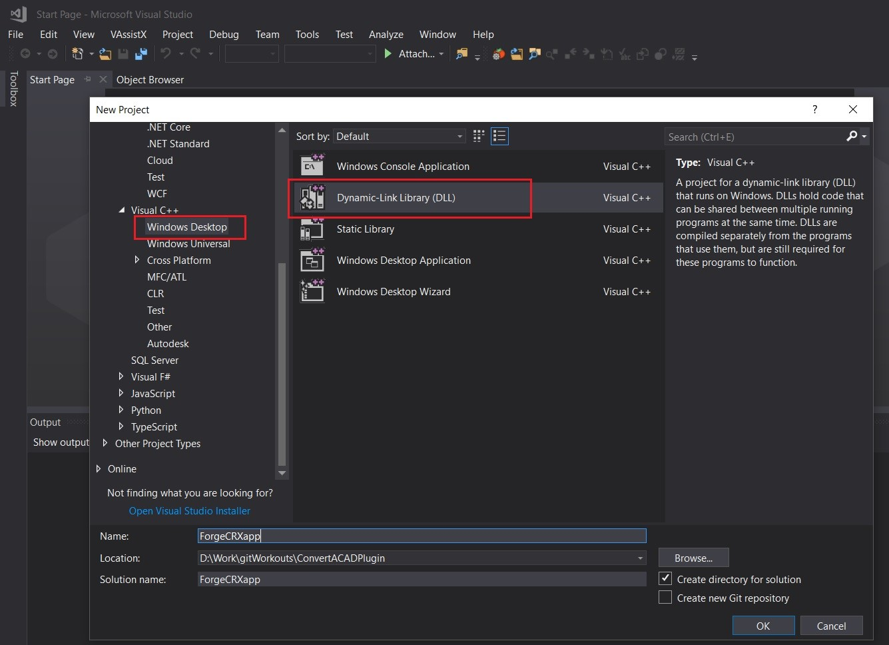
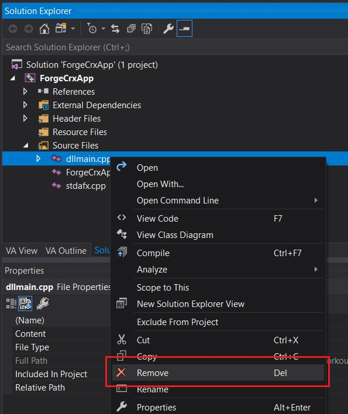
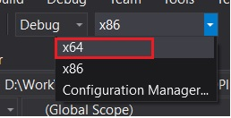
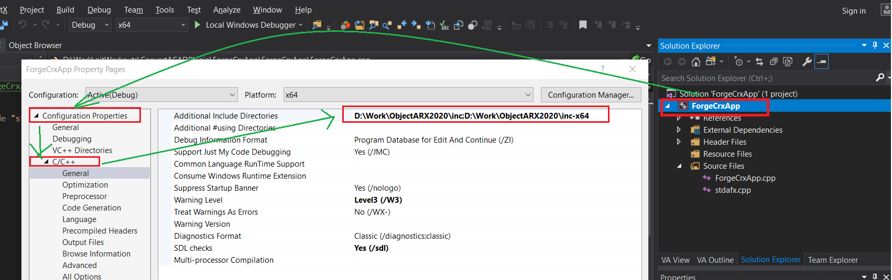
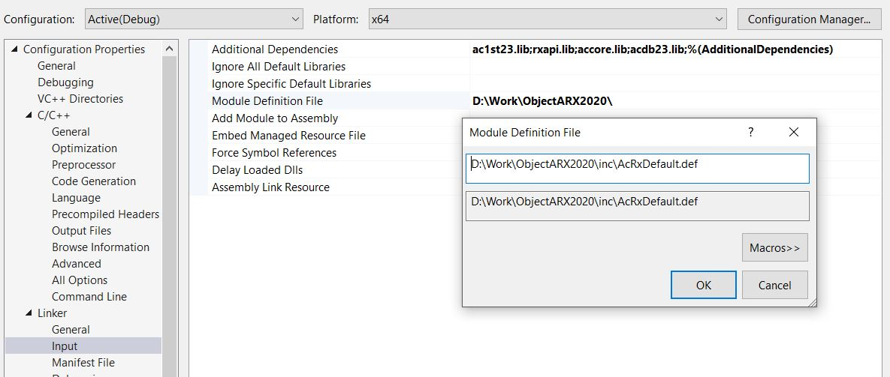
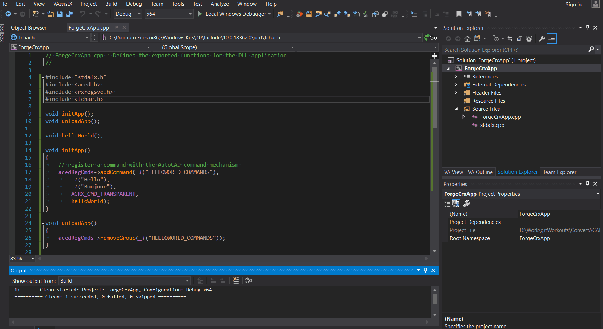
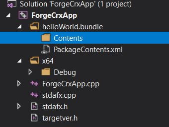
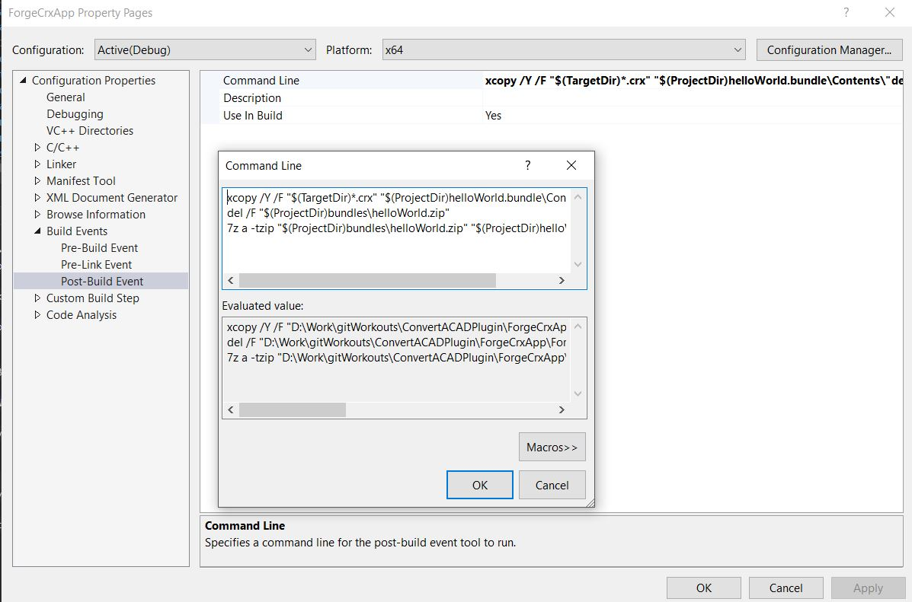

## How to convert your plugin to work with Design Automation for AutoCAD

Forge Design Automation for AutoCAD Engine accepts two kinds of modules 

1.  CRX, console runtime extension which is a C++ native application using AutoCAD Core ObjectARX API 
2.  NET, a net assembly which is a managed application using AutoCAD Core .NET API.

### Section: CRX
We will discuss how to create a `crx` application step by step, at the end of this tutorial you can also find a video tutorial and complete source code on GitHub.

#### Step 1: Launch
1. Launch visual studio 2017

2. Go to File->New->Project [Ctrl+Shift+N]

3. Select VC++->Windows Desktop->Dynamic Link Library

4. Enter name of the project

5. Click OK

   
   
   
   
   
   
   
#### Step 2: Create Project
1. Go to Solution Explorer

2. Remove the dllMain.cpp from Source Files, this file is unimportant.

   
   
3. Change the Debug Configuration from x86 to x64.

   
   
4. Build the Solution, your build should succeed, and following output will displayed in your Output window.

    ```
    1>------ Build started: Project: ForgeCrxApp, Configuration: Debug x64 ------
    1>stdafx.cpp
    1>ForgeCrxApp.cpp
    1>ForgeCrxApp.vcxproj -> D:\Work\gitWorkouts\ConvertACADPlugin\ForgeCrxApp\x64\Debug\ForgeCrxApp.dll
    ========== Build: 1 succeeded, 0 failed, 0 up-to-date, 0 skipped ==========
    ```


#### Step 3:  Integrating ObjectARX SDK

1. Go to Solution Explorer
2. Right Click on the Project, Click Properties.
3. Configuration Properties->C/C++->General
4. Select `Additional Include Directories` and enter your SDK Path

 

5. Go to Linker \ Input
6. Select `Additional Dependencies`,  add following minimum required libraries `ac1st23.lib
   rxapi.lib
   accore.lib
   acdb23.lib`
7. Go to Linker -> General, select `Additional Library Directories`
8. Go to Linker ->Input, select `Module Definition File` and add `<sdkpath>\inc\AcRxDefault.def`


   

 


9. Go to C/C++ ->Code Generation, select `Runtime Library` pick `Multi-Threaded DLL` from combo box. This indicates our multithreaded module is a Dynamically linked and specifies retail version of run-time library. 
NOTE: ObjectARX or CRX application are developed against release version of AutoCAD. Hence it is important to set run-time library to `/MD` not `/MDd`.

 

10. We are not including `acad.lib`, this what makes a significant different from a regular ARX application, `acad.lib` contains definitions of AutoCAD UI.

11. Forge Design Automation doesn't accept any UI related code.

12. Following is the table of AutoCAD libraries differentiating between `arx`,`dbx`,`crx`.

    

    | **LIBRARY**            | **OK in DBX** | **OK in CRX** | **OK in ARX** |
    | ---------------------- | ------------- | ------------- | ------------- |
    | ac1st23.lib            | YES           | YES           | YES           |
    | acdb23.lib             | YES           | YES           | YES           |
    | acdbmgd.lib            | YES           | YES           | YES           |
    | AcDbPointCloudObj.lib  | YES           | YES           | YES           |
    | acge23.lib             | YES           | YES           | YES           |
    | acgiapi.lib            | YES           | YES           | YES           |
    | acismobj23.lib         | YES           | YES           | YES           |
    | AcMPolygonObj23.lib    | YES           | YES           | YES           |
    | AcSceneOE.lib          | YES           | YES           | YES           |
    | axdb.lib               | YES           | YES           | YES           |
    | rxapi.lib              | YES           | YES           | YES           |
    | acbr23.lib             | YES           | YES           | YES           |
    | acgex23.lib            | YES           | YES           | YES           |
    | AdImaging.lib          | YES           | YES           | YES           |
    | AdIntImgServices.lib   | YES           | YES           | YES           |
    | AecModeler.lib         | YES           | YES           | YES           |
    | AsdkHlrApi23.lib       | YES           | YES           | YES           |
    | acapp_crx.lib          | NO            | YES           | YES           |
    | AcCamera.lib           | NO            | YES           | YES           |
    | accore.lib             | NO            | YES           | YES           |
    | AcFdEval.lib           | NO            | YES           | YES           |
    | AcPublish_crx.lib      | NO            | YES           | YES           |
    | acad.lib               | NO            | NO            | YES           |
    | acapp.lib              | NO            | NO            | YES           |
    | AcFdUi.lib             | NO            | NO            | YES           |
    | acModelDocObj.lib      | NO            | NO            | YES           |
    | AcTc.lib               | NO            | NO            | YES           |
    | AcTcUi.lib             | NO            | NO            | YES           |
    | acui23.lib             | NO            | NO            | YES           |
    | AdApplicationFrame.lib | NO            | NO            | YES           |
    | adui23.lib             | NO            | NO            | YES           |
    | aNav.lib               | NO            | NO            | YES           |
    | aseapi23.lib           | NO            | NO            | YES           |
    | asiapi23.lib           | NO            | NO            | YES           |

#### Step 4: Building

1. Open the ForgeCrxApp.cpp, add the following code snippet, this code registers a command to print `Hello World`.

   ```cpp
   // ForgeCrxApp.cpp : Defines the exported functions for the DLL application.
   //
   
   #include "stdafx.h"
   #include <aced.h> 
   #include <rxregsvc.h> 
   #include <tchar.h>
   
   void initApp();
   void unloadApp();
   
   void helloWorld();
   
   void initApp()
   {
   	// register a command with the AutoCAD command mechanism 
   	acedRegCmds->addCommand(_T("HELLOWORLD_COMMANDS"),
   		_T("Hello"),
   		_T("Bonjour"),
   		ACRX_CMD_TRANSPARENT,
   		helloWorld);
   }
   
   void unloadApp()
   {
   	acedRegCmds->removeGroup(_T("HELLOWORLD_COMMANDS"));
   }
   
   void helloWorld()
   {
   	acutPrintf(_T("\nHello World!"));
   }
   
   extern "C" AcRx::AppRetCode acrxEntryPoint(AcRx::AppMsgCode msg, void* pkt)
   {
   	switch (msg)
   	{
   	case AcRx::kInitAppMsg:
   		acrxDynamicLinker->unlockApplication(pkt);
   		acrxRegisterAppMDIAware(pkt);
   		initApp();
   		break;
   	case AcRx::kUnloadAppMsg:
   		unloadApp();
   		break;
   	default:
   		break;
   	}
   	return AcRx::kRetOK;
   }
   ```

   2. Build the solution, before that change the extension of the module to `.crx`.

      

#### Step5: Creating Bundle Package
1. Create a folder named `HelloWorld.bundle` and, inside, a file named PackageContents.xml, then copy the following content to it. Learn more at the PackageContents.xml [Format Reference](https://knowledge.autodesk.com/search-result/caas/CloudHelp/cloudhelp/2016/ENU/AutoCAD-Customization/files/GUID-BC76355D-682B-46ED-B9B7-66C95EEF2BD0-htm.html). This file defines the new AutoCAD custom command `Bonjour` that will be called when Design Automation executes.

   ```xml
   <?xml version="1.0" encoding="utf-8" ?>
<ApplicationPackage SchemaVersion="1.0" Version="1.0" ProductCode="{937C48B7-5F56-4E61-A95F-AC7FA39B32E9}" Name="FDA-AutoCAD" Description="Sample Plugin for AutoCAD" Author="learnforge.autodesk.io">
    <CompanyDetails Name="Autodesk, Inc" Url="https://forge.autodesk.com/en/support/get-help" Email="forge.help@autodesk.com"/>
    <Components>
    <RuntimeRequirements OS="Win64" Platform="AutoCAD"/>
    <ComponentEntry AppName="HelloWorld" ModuleName="./Contents/ForgeCrxApp.crx" AppDescription="AutoCAD .CRX App to print HelloWorld" LoadOnCommandInvocation="True" LoadOnAutoCADStartup="True">
      <Commands GroupName="HELLOWORLD_COMMANDS">
        <Command Global="Hello" Local="Bonjour"/>
      </Commands>
    </ComponentEntry>
    </Components>
</ApplicationPackage>
   ```

 Finally, create a subfolder named `Contents` and leave it empty. At this point, the project should look like: 



2. Now we need to ZIP the .bundle folder. Right-click on the project, select **Properties**, then open **Build Events** and copy the following into **Post-build event command line** field, as shown on the image below.

   ```bash
   xcopy /Y /F "$(TargetDir)*.crx" "$(ProjectDir)helloWorld.bundle\Contents\"
   del /F "$(ProjectDir)bundles\helloWorld.zip"
   7z a -tzip "$(ProjectDir)bundles\helloWorld.zip" "$(ProjectDir)helloWorld.bundle\"
   ```

3.  This will copy the `.crx` from /x64/debug/ into .bundle/Contents folder, then use [7zip](https://www.7-zip.org/) to create a zip, then finally copy the ZIP into /bundles folders of the ForgeCrxApp. 

   

   4.  If you build the `ForgeCrxApp` project now you should see something like this on the **Output** window. Note the 2 folders and 2 files zipped. The zip file is created directly at the /bundles folder. This means you're doing great! 

```bash
1>------ Build started: Project: ForgeCrxApp, Configuration: Debug x64 ------
1>ForgeCrxApp.vcxproj -> D:\Work\gitWorkouts\ConvertACADPlugin\ForgeCrxApp\x64\Debug\ForgeCrxApp.crx
1>D:\Work\gitWorkouts\ConvertACADPlugin\ForgeCrxApp\x64\Debug\ForgeCrxApp.crx -> D:\Work\gitWorkouts\ConvertACADPlugin\ForgeCrxApp\ForgeCrxApp\helloWorld.bundle\Contents\ForgeCrxApp.crx
1>1 File(s) copied
1>Could Not Find D:\Work\gitWorkouts\ConvertACADPlugin\ForgeCrxApp\ForgeCrxApp\bundles\helloWorld.zip
1>
1>7-Zip 19.00 (x64) : Copyright (c) 1999-2018 Igor Pavlov : 2019-02-21
1>
1>Scanning the drive:
1>2 folders, 2 files, 63283 bytes (62 KiB)
1>
1>Creating archive: D:\Work\gitWorkouts\ConvertACADPlugin\ForgeCrxApp\ForgeCrxApp\bundles\helloWorld.zip
1>
1>Add new data to archive: 2 folders, 2 files, 63283 bytes (62 KiB)
1>
1>
1>Files read from disk: 2
1>Archive size: 13331 bytes (14 KiB)
1>Everything is Ok
========== Build: 1 succeeded, 0 failed, 0 up-to-date, 0 skipped ==========
```

#### Step6: Debugging Crx Application Locally
1. Please refer full [youtube video](https://www.youtube.com/watch?v=66X7iOiRJaU&feature=youtu.be), this video also covers all the steps which we discussed now.

### Section: .NET
1. Please refer Forge Design Automation for [AutoCAD](https://learnforge.autodesk.io/#/designautomation/appbundle/engines/autocad)